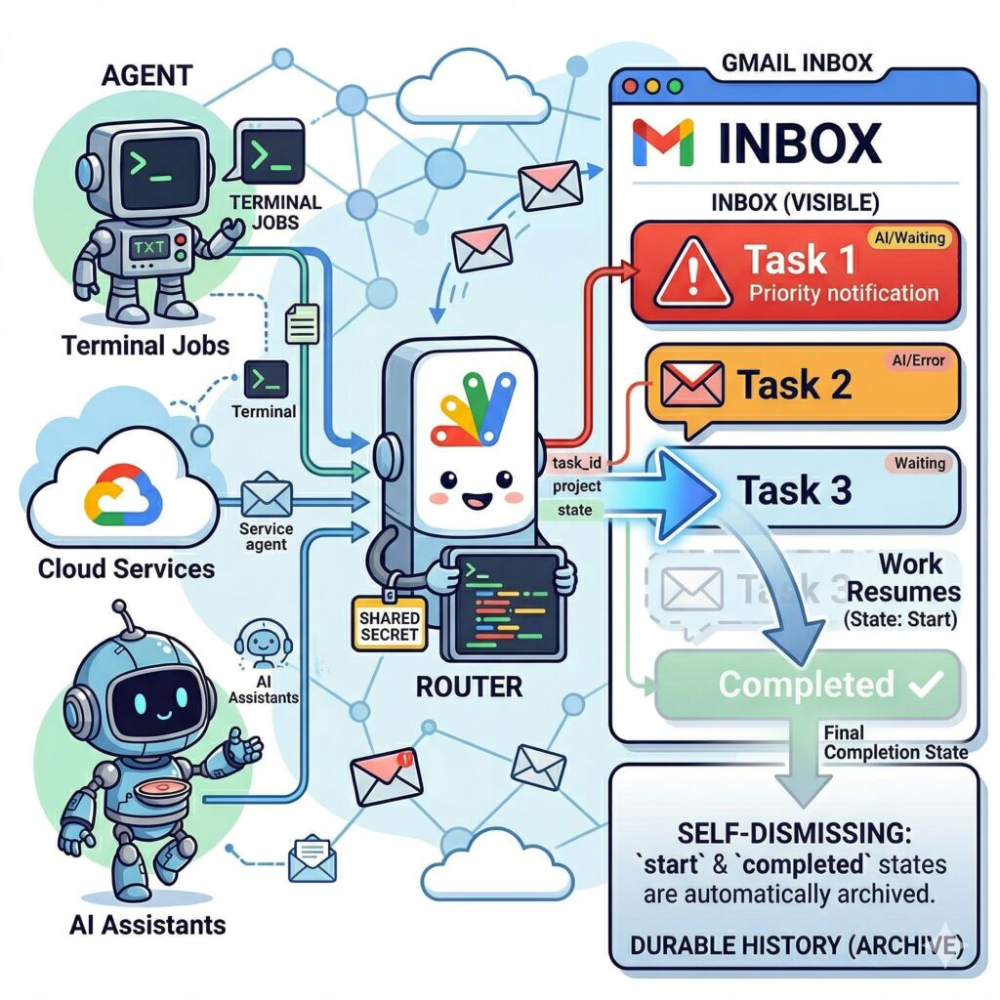
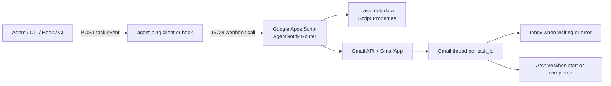
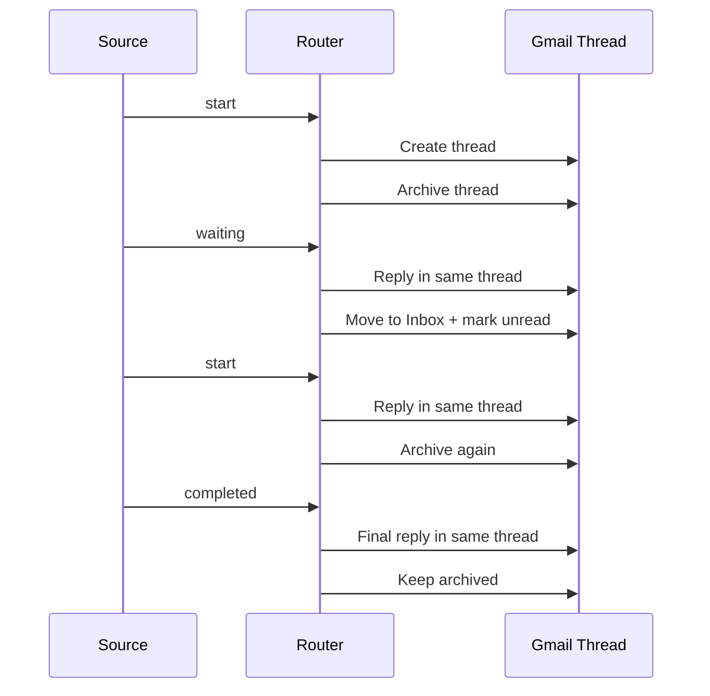

# agent-ping

Turn Gmail into a self-dismissing notification center for long-running agent work.

`agent-ping` sends task lifecycle events to a Google Apps Script webhook. The webhook stores one Gmail thread per task, keeps `waiting` and `error` states visible in the inbox, and automatically archives `start` and `completed` states. The result is simple and unusually effective:

- Your inbox becomes a live "waiting on me" queue.
- Every task keeps its full history in one Gmail conversation.
- Resumed or finished work disappears from the inbox without deleting history.



## Why this is interesting

Most notification systems are noisy because they treat every update as a new alert. This project does the opposite.

It treats Gmail threads as the state container for a task:

- `waiting` means "show me this"
- `start` means "hide it again, work resumed"
- `completed` means "archive it, but keep the record"
- `error` means "bring it back to the inbox"

That makes the inbox act less like a stream of alerts and more like a task board that cleans itself up.

## System Diagram



## Thread Lifecycle



## What is in this repo

- A Go library for sending task events to the webhook
- A small CLI, `agent-ping`
- A Google Apps Script router that manages Gmail threading and labels
- A Claude Code hook helper for automatic session lifecycle notifications

## Event Model

Every event uses the same payload shape:

```json
{
  "task_id": "uuid-or-stable-id",
  "project": "my-project",
  "state": "start|waiting|completed|error",
  "source": "claude-code",
  "title": "Waiting for approval",
  "details": "Optional longer text",
  "timestamp": "2026-04-06T07:00:00Z"
}
```

`task_id` is the key design choice. It is the stable identity that maps one logical task to one Gmail thread.

## How Gmail behaves

The Apps Script router applies a simple visibility rule:

| State | Gmail behavior |
| --- | --- |
| `start` | Append to thread, mark read, archive |
| `waiting` | Append to thread, move to inbox, mark unread |
| `completed` | Append to thread, mark read, archive |
| `error` | Append to thread, move to inbox, mark unread, add error label |

Labels used by default:

- `AI/All`
- `AI/Waiting`
- `AI/Error`
- `AI/Project/<project>`

## Quick Start

### 1. Deploy the Apps Script router

Use [`appscript/Code.gs`](appscript/Code.gs) and the template [`appscript/Setup.gs.example`](appscript/Setup.gs.example). Copy the template to `Setup.gs`, fill in your values, and run `setupProperties()` once from the Apps Script editor.

Required script properties:

- `TARGET_EMAIL` — your Gmail address
- `SHARED_SECRET` — shared secret for authenticating webhook requests (must match `AGENT_PING_SECRET` on the client side)

Then deploy the project as a web app and copy the deployment URL.

More detail:

- [`docs/DESIGN-APPS-SCRIPT.md`](docs/DESIGN-APPS-SCRIPT.md)
- [`docs/DESIGN.md`](docs/DESIGN.md)

### 2. Build the CLI

```bash
go build ./cmd/agent-ping
```

### 3. Configure environment variables

```bash
export AGENT_PING_WEBHOOK_URL="https://script.google.com/macros/s/YOUR_DEPLOYMENT_ID/exec"
export AGENT_PING_SECRET="your-shared-secret"
```

### 4. Send a test event

```bash
go run ./cmd/agent-ping \
  -task-id demo-123 \
  -project demo \
  -state waiting \
  -source cli \
  -title "Need approval" \
  -details "Please review the generated migration plan."
```

If the router is configured correctly, you should see a Gmail thread appear in your inbox. Reuse the same `-task-id` with `-state start` or `-state completed` and that same thread should auto-dismiss into the archive.

## Claude Code Hook Integration

[`scripts/agent-ping-hook`](scripts/agent-ping-hook) maps Claude Code session events to `agent-ping` states and deduplicates repeated transitions per session.

The practical effect:

- session starts -> archived thread is created or updated
- agent stops for user input -> thread moves into inbox
- user replies and work resumes -> same thread is archived again
- session ends -> final completion message stays archived

Setup guide:

- [`docs/SETUP-CLAUDE-CODE-HOOKS.md`](docs/SETUP-CLAUDE-CODE-HOOKS.md)

## Go Library Usage

```go
client := agentping.NewClient(os.Getenv("AGENT_PING_WEBHOOK_URL"))
client.Secret = os.Getenv("AGENT_PING_SECRET")

resp, err := client.Send(context.Background(), agentping.Event{
    TaskID:  "demo-123",
    Project: "demo",
    State:   agentping.StateWaiting,
    Source:  "my-agent",
    Title:   "Waiting for input",
    Details: "Choose rollout strategy A or B.",
})
if err != nil {
    log.Fatal(err)
}

fmt.Println(resp.ThreadID)
```

## Repository Layout

- [`agentping.go`](agentping.go): Go client and event types
- [`cmd/agent-ping/main.go`](cmd/agent-ping/main.go): CLI entrypoint
- [`appscript/Code.gs`](appscript/Code.gs): Gmail router implementation
- [`scripts/agent-ping-hook`](scripts/agent-ping-hook): Claude Code hook wrapper

## Development

```bash
make check
```

That runs formatting checks, `go vet`, tests, and a build.

## The Core Idea

The unusual part of this project is not the webhook or the Go client. It is the decision to use Gmail conversations as durable task state, and the inbox as an attention surface that clears itself when work resumes.

That makes `agent-ping` less like a notifier and more like a personal operations console built on infrastructure you already trust.
